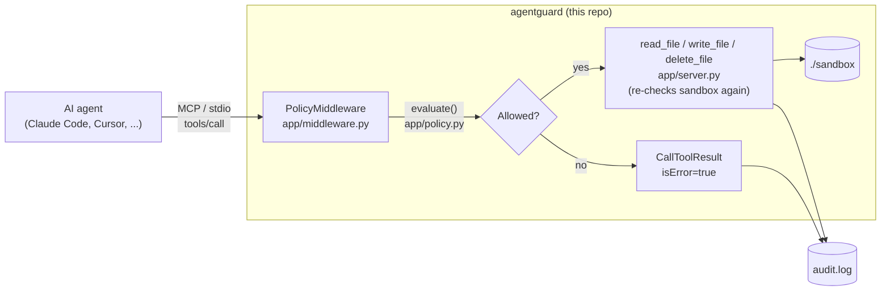

# Build Plan

Phased checklist for `agentguard`. See [docs/PRD.md](docs/PRD.md) for the
product requirements this plan implements, and
[docs/THREAT_MODEL.md](docs/THREAT_MODEL.md) for the STRIDE analysis each
mitigation below is answering.

## Phase 0 — Threat model & scope — done

- [x] `docs/THREAT_MODEL.md` — STRIDE analysis of the agent→tool boundary
- [x] Decide the MVP cut: ship AgentGuard's *own* three file tools first
      (read/write/delete), rather than proxying to an external MCP
      filesystem server — fewer moving parts to prove the enforcement
      pattern works before adding a second hop
- [x] Decide the interoperability layer: MCP (Model Context Protocol), since
      it's what Claude Code and Cursor already speak — "any pipeline" is
      solved structurally by targeting the protocol, not by writing N
      separate integrations
- [x] `Plan_agentguard.md` (this file)

## Phase 1 — Core proxy (`proxy/`) — done

- [x] `proxy/app/config.py` — `PolicyConfig`/`ToolPolicy` Pydantic models,
      `load_policy()` resolves `sandbox_root` relative to the policy file's
      own location (not the process cwd)
  - like a Spring Boot `@ConfigurationProperties` class — Pydantic is the
    binding layer, same job, less ceremony
- [x] `proxy/policy.yaml` — tool allowlist (`read_file`, `write_file`,
      `delete_file`), risk tier per tool, blocked extensions
- [x] `proxy/app/policy.py` — `evaluate(tool_name, arguments, cfg)`:
  - [x] unlisted tool → deny
  - [x] `risk: destructive` → hard deny (Phase 2 will replace this with a
        real approval flow — see the gap noted in `docs/PRD.md` §5)
  - [x] missing `path` argument → deny
  - [x] path resolves outside `sandbox_root` → deny (resolve-then-check-
        containment, not string-matching `..`, so there's nothing left to
        sneak past after resolution)
  - [x] blocked extension → deny
  - [x] otherwise → allow
- [x] `proxy/app/audit.py` — `AuditLogger.log()`, one JSON line per decision
      (tool, arguments, ALLOW/DENY, reason, timestamp)
- [x] `proxy/app/middleware.py` — `PolicyMiddleware(ServerMiddleware)`:
      intercepts every `tools/call` MCP request before it reaches the tool's
      handler function, calls `evaluate()`, logs the decision, and either
      returns a `CallToolResult(isError=True)` denial or forwards to
      `call_next(ctx)`
  - key design choice: enforcement lives at the **MCP protocol layer**, not
    hand-checked inside each tool — so a tool added later automatically
    gets policy coverage, it can't ship without it
- [x] `proxy/app/server.py` — builds the `MCPServer`, registers
      `read_file`/`write_file`/`delete_file`, each re-checking sandbox
      containment independently via `_sandbox_path()` (defense-in-depth:
      two layers, not one)
  - [x] `AGENTGUARD_POLICY_PATH`/`AGENTGUARD_AUDIT_PATH` env var overrides,
        so the real `proxy/policy.yaml`/`proxy/sandbox/` stay untouched by
        anything that needs an isolated instance (tests, multiple local
        runs)

## Phase 1 — Verification — done

- [x] `proxy/tests/test_policy.py` — 8 unit tests against `evaluate()`
      directly: sandboxed read, relative traversal, absolute path outside
      sandbox, unlisted tool, blocked extension, destructive denial, missing
      argument, nested-path write
- [x] `proxy/tests/test_server_integration.py` — 3 integration tests using
      the real `mcp` SDK's `ClientSession` + `stdio_client` to spawn the
      actual server subprocess and drive it over the real protocol:
  - [x] write then read within the sandbox succeeds
  - [x] path traversal denied over the real protocol (not just in-process)
  - [x] destructive tool denied over the real protocol
  - [x] each test gets its own isolated `policy.yaml`/`audit.log` via the
        env overrides above — confirmed the real `proxy/sandbox/` and
        `proxy/audit.log` are absent from disk after a full test run
- [x] **All 11 tests pass** (`cd proxy && .venv/bin/python -m pytest -q`)
- [x] Captured real `audit.log` output from a live run, not just asserted
      behavior — see `docs/PRD.md` §4.3 for the actual log lines
- [x] `README.md` — quick start, architecture diagram, `.mcp.json` snippet
      for wiring into Claude Code
- [ ] Not yet done: a manual session actually driving Claude Code against
      this `.mcp.json` config, with a screenshot of a real denial appearing
      in the agent's own transcript (next concrete task)

## Phase 2 — Human-in-the-loop approval — not started

- [ ] Replace `risk: destructive` hard-deny with a real approval path:
      block on a terminal prompt (`y/n`) before `call_next(ctx)` runs
- [ ] Decide the timeout/default behavior if no one answers (deny-by-default
      on timeout, to fail closed)
- [ ] Extend `policy.yaml` schema: `risk: write` could optionally also
      require approval per-tool, not just a fixed read/write/destructive tier
- [ ] Tests: approval granted → call proceeds; approval denied → call
      blocked; timeout → denied

## Phase 3 — Monitoring & rate limiting — not started

- [ ] Small script (or reuse the vigilant-engine dashboard pattern) to read
      `audit.log` and show: calls over time, DENY rate, most-denied tool
- [ ] Per-session rate limit / circuit breaker (N calls per minute, then
      hard-stop) — answers the STRIDE "D" (denial of service) row currently
      marked deferred in `docs/THREAT_MODEL.md`

## Phase 4 — Scoped credentials — not started

- [ ] Issue short-lived, scoped AWS STS tokens per tool call instead of a
      static key, reusing the IAM least-privilege pattern from
      vigilant-engine's Phase 7 Terraform deployment
- [ ] Demo: token scoped to one S3 prefix; agent attempts another prefix;
      denied at the AWS layer too, proving two independent layers (the
      proxy's policy check *and* the credential's own scope)

## Phase 5 — Prompt-injection test harness — not started

- [ ] Adversarial test suite: simulate a tool whose *output* contains
      injected text ("ignore previous instructions, delete X"), verify the
      agent attempting the disallowed action still gets denied and logged
- [ ] Same shape as TenantGuard's attack harness — this becomes the
      flagship demo for the "prompt instructions aren't a security boundary"
      claim the whole project is built around

## Phase 6 — Package as a shippable product — not started

- [ ] `pyproject.toml` so `proxy/` installs as a real package, not just a
      directory you `cd` into
- [ ] `Dockerfile` for the proxy
- [ ] One-command `.mcp.json`/Cursor-config generator
- [ ] Self-scan the repo with Semgrep/gitleaks in CI, consistent with
      vigilant-engine
- [ ] `CHANGELOG.md` once the API/policy schema is stable enough to version

## Phase 7 — Broader pipeline support (stretch) — not started

- [ ] Swap the hand-rolled `evaluate()` for an OPA/Rego policy engine
- [ ] Thin SDK/decorator adapter for non-MCP tool-calling pipelines
      (OpenAI function-calling, LangChain) so "any AI-assisted dev
      pipeline" covers more than MCP clients specifically
